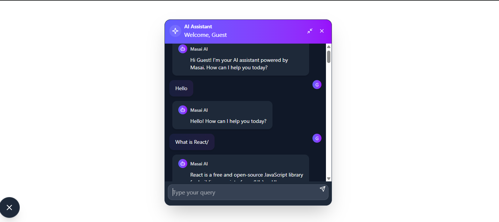

# AI-Chatboat
🤖 AI-powered chatbot interface built using Gemini AI, React, and Tailwind CSS.

An interactive, responsive AI-powered chatbot built using **React**, **Tailwind CSS**, **Gemini AI**, and **Lucide Icons**. This chatbot can answer user queries in real-time and provides a minimal yet elegant user interface.

---

### 🚀 Demo


### ✨ Features

* 💬 Chatbot powered by **Gemini AI**
* 🢁 Personalized user greetings from `localStorage`
* 💡 Light-weight and mobile responsive UI
* 💻 Built using **React**, **Tailwind CSS**, **Lucide Icons**
* ⚡ Smooth animations and transitions
* 📜 Markdown support for better message formatting

---

### 🛠️ Tech Stack

| Tech           | Used For                    |
| -------------- | --------------------------- |
| React          | Frontend Framework          |
| Tailwind CSS   | Styling & Responsive Design |
| Gemini AI      | AI Response Generation      |
| Lucide React   | Icons                       |
| React Markdown | Rendering Markdown in Chat  |
| Vite           | Development Build Tool      |

---

### 📁 Folder Structure

```
my-AIChatgpt-react-app/
├── public/
│   └── _redirects          # Netlify redirects for SPA routing
├── src/
│   ├── chatboat/
│   │   ├── ChatButton.jsx  # Floating Chat Icon Button
│   │   ├── ChatMessage.jsx # Message Component
│   │   └── ChatWindow.jsx  # Main Chat UI and Logic
│   └── App.jsx             # Entry Point
├── package.json
└── README.md
```

---

### 🔧 Setup Instructions

```bash
# Clone the repo
git clone https://github.com/your-username/ai-chatbot-react.git

# Navigate to folder
cd ai-chatbot-react

# Install dependencies
npm install

# Start development server
npm run dev
```

---

### ⚙️ Deployment (Netlify)

1. Build the project:

   ```bash
   npm run build
   ```

2. Upload the `dist` folder to Netlify or link your GitHub repo to Netlify.

3. Make sure you add `_redirects` file in the `public` folder:

   ```
   /*    /index.html   200
   ```

---


### 📸 Screenshots

| Chatbot UI                          | Chat in Action                       |
| ----------------------------------- | ------------------------------------ |
|  |  |

---

### 🙌 Acknowledgements

* [Google Gemini AI](https://makersuite.google.com/)
* [Tailwind CSS](https://tailwindcss.com/)
* [Lucide Icons](https://lucide.dev/)
* [React Markdown](https://github.com/remarkjs/react-markdown)

---

### 📃 License

MIT © 2025 Shrutika Gadekar
